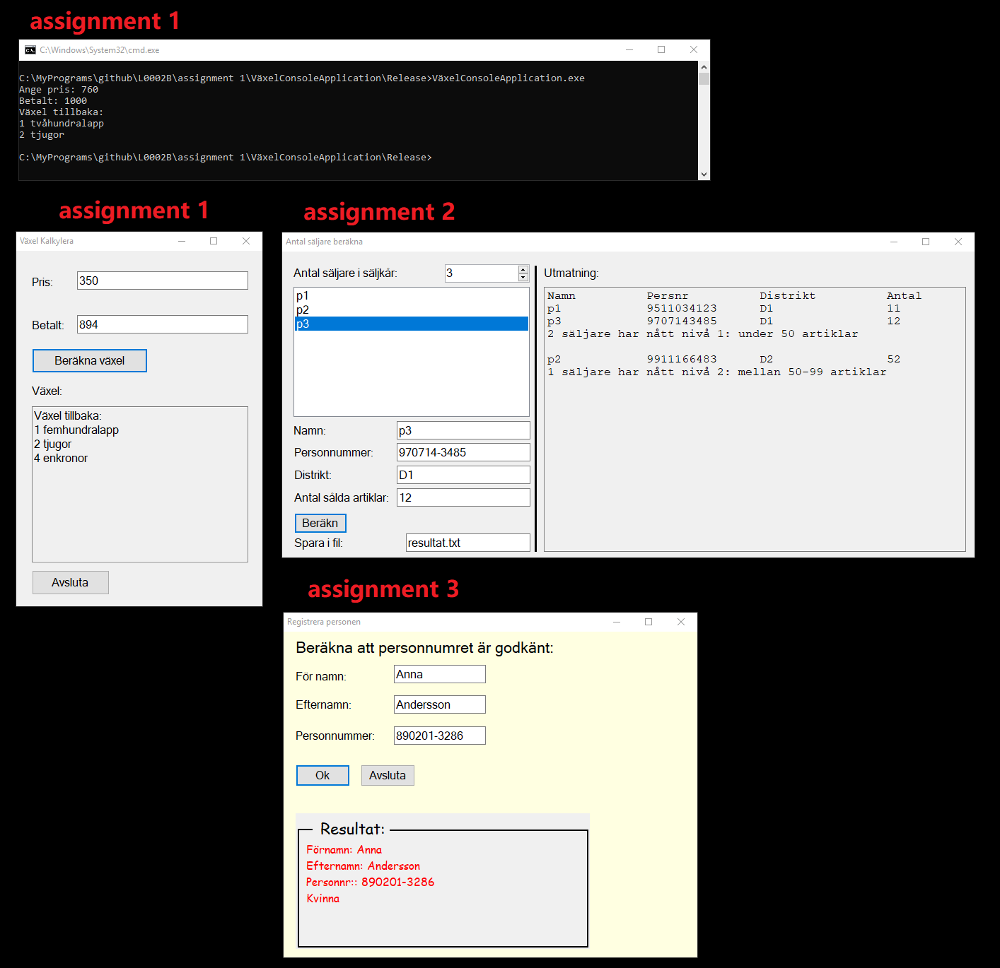

# L0002B
This is the work that was done by philip0000000, for the course "Introduktion till programmering och C#"(Introduction to Programming and C#) at Luleå University of Technology. The course number is L0002B, more info at: https://www.ltu.se/edu/course/L00/L0002B/L0002B-Introduktion-till-programmering-och-C-1.68374?kursplanId=23072.

Contains source code for 3 assignments which are all in Swedish and notes that were made while studying the C# programming language, which are in english.

This course lasted for 2 months, September and October, in the year 2022. The entire course was done remotely.

